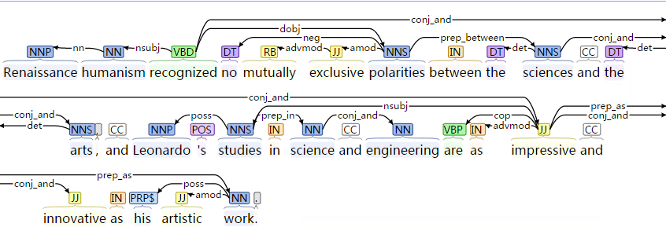

#EXPERIMENTS

=====

##Tree parsing results

example:

* verb results for "STEVE JOBS" and "PIXAR"

<pre>
	# correct relations
	co-founded
	served.
	
	
	
	#in clauses
	announced expired.
	announced expired.
	announced had agreed.
	floyd described interfered.
	revealed advised understand.
	
	#passive voice
	dedicating was wrote.
	dedicating was wrote was dear guiding.
	are dedicated.
	bought was given.
	was running 
	tried
	failed 
</pre>

=====

* "mona lisa" "renaissance"

	* da_vinci renaissance
	<pre>
		saw known
		inspired.
		inspired.
		were making.
	</pre>
	
	* mona lisa da_vinci
	<pre>
		began painting.
	</pre>

the relationship between 
=====

renaissance_da_vinci

=====
renaissance_da_vinci

=====
renaissance_da_vinci

=====
renaissance_da_vinci

=====
renaissance_da_vinci

=====
renaissance_da_vinci

=====
renaissance_da_vinci

=====
renaissance_da_vinci

=====
monalisa_da_vinci

=====
monalisa_da_vinci

=====
monalisa_da_vinci

=====
monalisa_da_vinci

=====
monalisa_da_vinci

=====
monalisa_da_vinci

=====
monalisa_da_vinci

=====
monalisa_da_vinci

=====
steve_jobs_pixar

=====
steve_jobs_pixar

=====
steve_jobs_pixar

=====
steve_jobs_pixar

=====
steve_jobs_pixar

=====
steve_jobs_pixar

=====
steve_jobs_pixar

=====
steve_jobs_pixar

=====

##results: dependencies
 

##hard sentences

