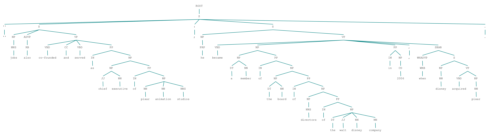

#EXPERIMENTS

=====

##Tree parsing results

* verb results for "STEVE JOBS" and "PIXAR"
<pre>
	co-founded served.
	bought was given.
	was running tried failed announced expired.
	announced expired.
	.
	announced had agreed.
	floyd described interfered.
	revealed advised understand.
	dedicating was wrote.
	dedicating was wrote was dear guiding.
	are dedicated.
</pre>

======

======

======

======

======

======

======

======

======

======

======

======

======

======

======

======

======

======

======

======

======

======

======

======
